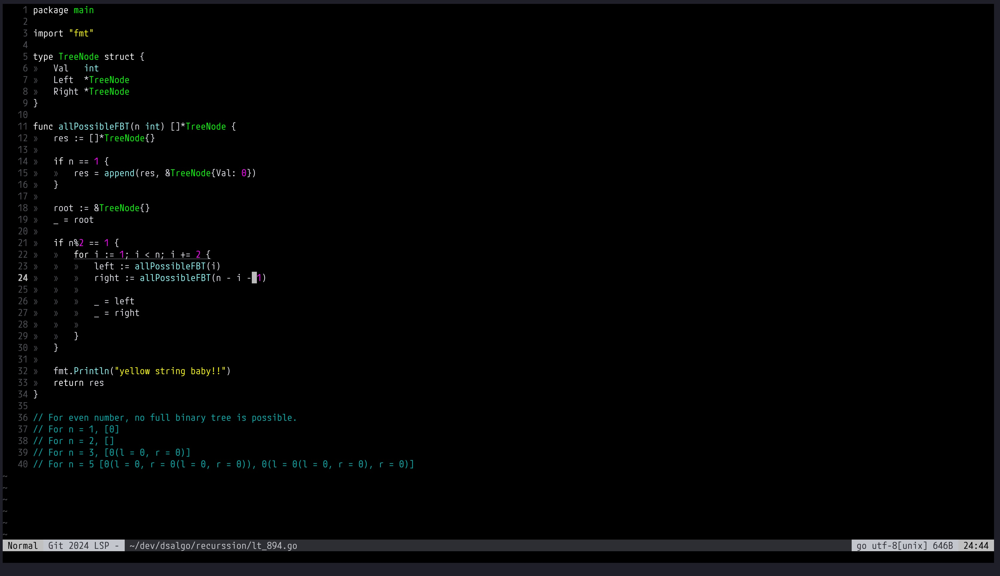
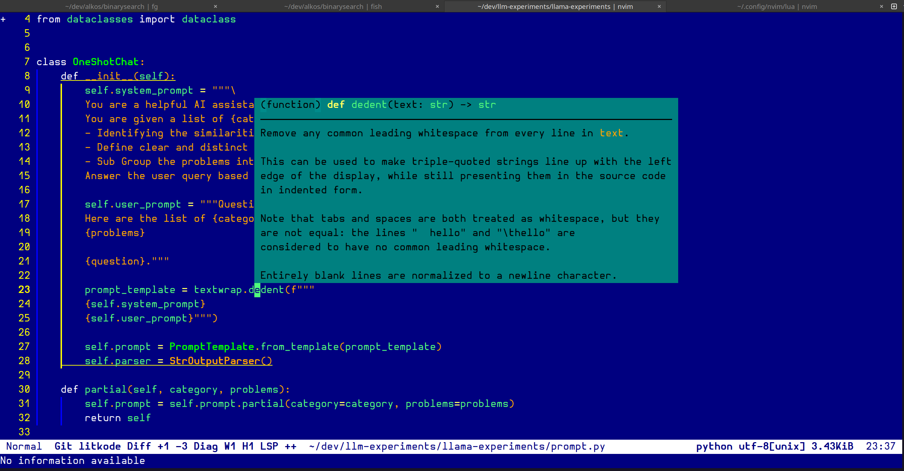

## turboc.nvim

Colorscheme resembling the age old [Turbo-C](https://en.wikipedia.org/wiki/Turbo_C%2B%2B)

### Installation

I haven't looked into how to package it, but I hear there is a [slideshow by iceberg dev](https://speakerdeck.com/cocopon/creating-your-lovely-color-scheme?slide=23)

[Packaging Guide for lazy.nvim](https://m4xshen.dev/posts/develop-a-neovim-plugin-in-lua)

But, overall, put the folder in your `$NVIM_APPNAME` directory, mine is `~/.config/nvim/`.

```shell
curl -s \
  "https://raw.githubusercontent.com/ikouchiha47/turboc.nvim/refs/heads/master/setup.sh" | bash -x
```

### Activating

With [lazy.nvim](https://github.com/folke/lazy.nvim), the configuration looks:

```lua
return {
  name = 'turboc',
  dir = vim.fn.stdpath 'config' .. '/colors/turbovision',
}
```

`:colorscheme turboc`
`:colorscheme turboc-pascal`

### Plans

Learn a bit more about theming, and try to modernise this.

### How it looks

#### black



#### blue


