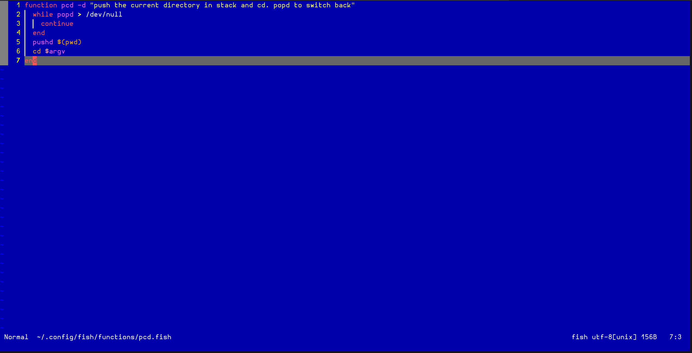
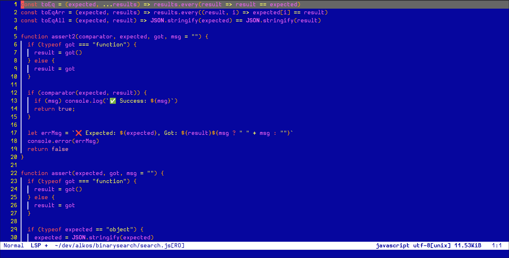
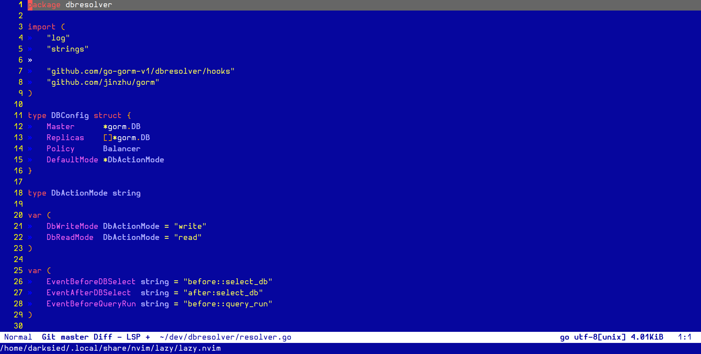

## turboc.nvim

Colorscheme resembling the age old [Turbo-C](https://en.wikipedia.org/wiki/Turbo_C%2B%2B)


### Installation

I haven't looked into how to package it, but I hear there is a slideshow by iceberg dev. [link](https://speakerdeck.com/cocopon/creating-your-lovely-color-scheme?slide=23)

But, overall, put the folder in your `$NVIM_APPNAME` directory, mine is `~/.config/nvim/`, like:

```shell
git clone https://github.com/ikouchiha47/turboc.nvim:turboc ~/.config/$NVIM_APPNAME/colors/
```

With [lazy.nvim](https://github.com/folke/lazy.nvim), the configuration looks:

```lua
return {
  name = 'turboc',
  dir = '~/.config/nvim/colors/turboc',
  config = function()
    require('colors.turboc.init').setup {}

    vim.g.colors_name = 'turboc'
  end,
}
```

### Plans:

Learn a bit more about theming, and try to modernise this.


### How it looks:







